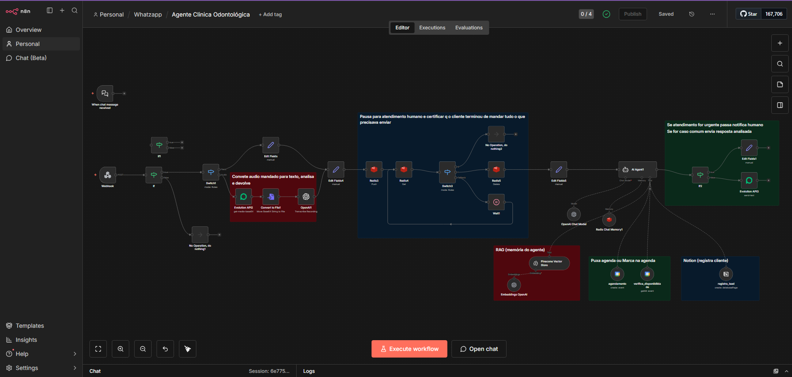

# Sistema de Automação de Atendimento 24/7 com n8n

Sistema de **automação de atendimento ao cliente** desenvolvido para empresas que lidam com alto volume de mensagens e precisam reduzir custos operacionais, melhorar tempo de resposta e manter atendimento contínuo (24/7).

---

## Visão Geral

O projeto utiliza o **n8n como orquestrador** para automatizar o fluxo de atendimento, integrando WhatsApp, banco de dados e serviços auxiliares para coleta, validação e persistência de dados do cliente.

O sistema foi projetado para ser **escalável**, com controle de estado e possibilidade de escalonamento para atendimento humano.

---

## Funcionalidades Principais

- Recebimento de mensagens via WhatsApp
- Filtragem e interpretação de mensagens (texto e áudio)
- Coleta e validação de dados do cliente
- Cadastro automático de novos clientes
- Persistência de dados em banco
- Gerenciamento de contexto da conversa
- Resposta automatizada ao usuário
- Encaminhamento para atendimento humano quando necessário

---

## Arquitetura

- **n8n**: orquestração do fluxo e decisões lógicas  
- **Evolution API**: comunicação com WhatsApp  
- **Redis**: controle de estado e contexto da conversa  
- **PostgreSQL**: persistência de dados e histórico  
- **Cloudflare**: segurança e proxy dos webhooks  

---

## Tecnologias

- n8n
- APIs REST
- Evolution API
- Redis
- PostgreSQL
- Cloudflare

---

## Demonstração

---

## Próximos Passos

- Integração com API intermediária em Python
- Validação avançada de dados
- Métricas e logs de atendimento

---

*Projeto desenvolvido como demonstração prática de automação de atendimento e integração de sistemas.*
